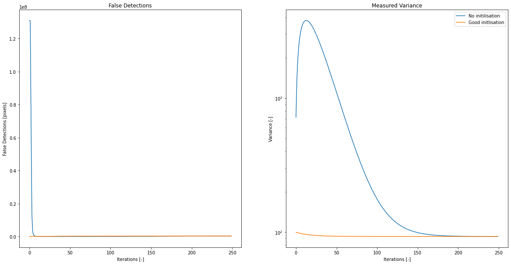
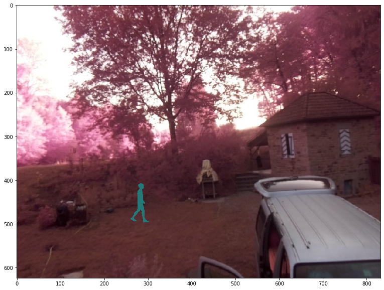
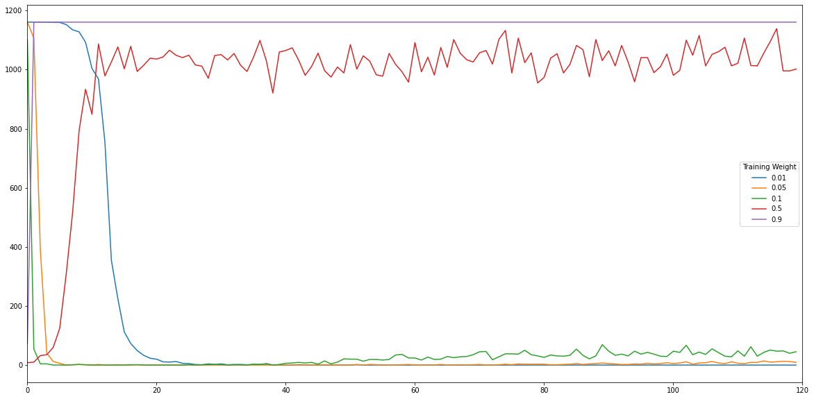
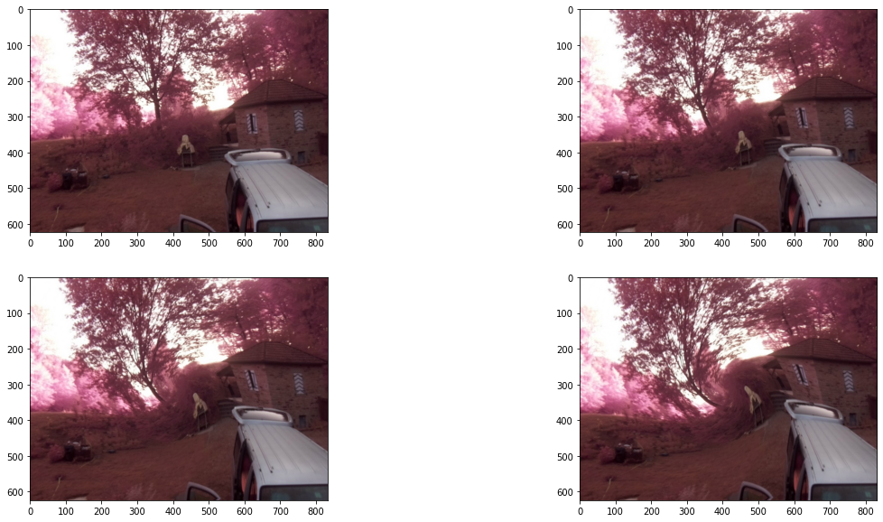
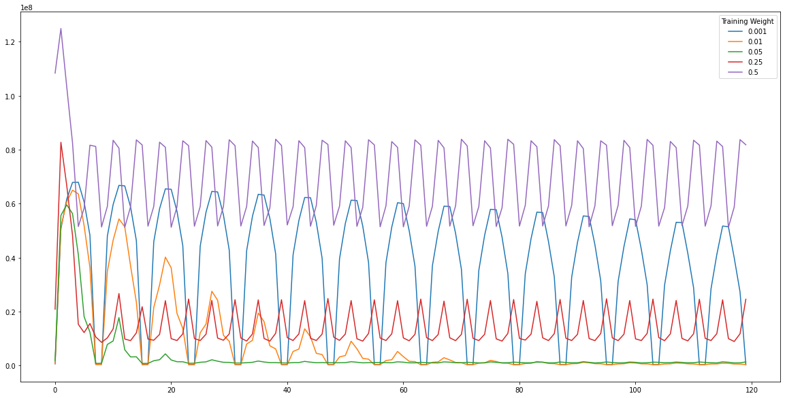
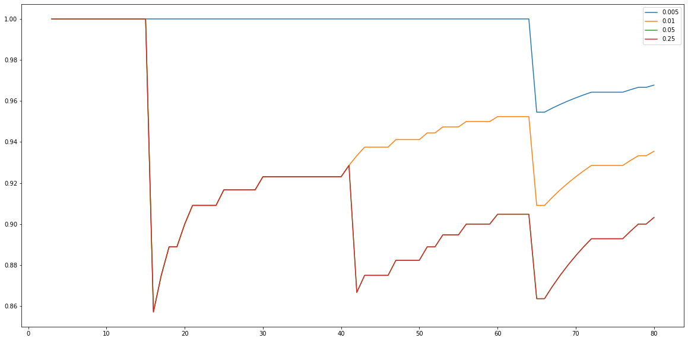

# Example on using EMA background subtraction

This is a test case notebook which demonstrates how EMA background subtraction works. After going through this the user should be familiar with the method and how the parameter selection and scene effect the outcome.


```python
from motion_detectors import EMAV_background_subtracting_motion_detection as bgd
#%matplotlib widget
```


```python
from PIL import Image
import numpy as np
from scipy.ndimage import zoom
import matplotlib.pyplot as plt
plt.rcParams['figure.figsize'] = [20, 10]
example = np.array(Image.open('example.jpg'))
```

# Initialisation and false detections

My experience so far is that false detections are a greater issue than tuning the system for true detections, and tuning the system can be very painful as the system needs time to learn the background, so changing settings often means true results come minutes later. To speed this up good initialisation of the detector class is required. To simulate a noisy camera we add noise to the image at each update, to show how a good initialisation can improve results we create two detectors one initialised with the perfect values the other with zeros. We can then quantify the convergence of the false detections and the variance.


```python

variance = 100 # the variance to be used for simulated camera noise.

detector_no_initialisation = bgd(0.05,16,example.shape, initial_average=np.zeros(example.shape), initial_variance=1, minimum_variance=18)

detector_good_initialisation = bgd(0.05,16,example.shape, initial_average=example, initial_variance=variance, minimum_variance=18)
```


```python
plt.imshow(example)
```


    <matplotlib.image.AxesImage at 0x7fab89447d68>


```python
false_postives_no_init = []
measured_variance_no_init  = []

false_postives_good_init = []
measured_variance_good_init  = []

for i in range(250):
    noisy_image = example+np.random.normal(0, variance**0.5, example.shape)
    # rember the camera clips values
    noisy_image[noisy_image<0]=0
    noisy_image[noisy_image>255]=255
    
    detections_no_init=detector_no_initialisation.apply(noisy_image)
    false_postives_no_init.append(np.sum(detections_no_init))
    measured_variance_no_init.append(np.mean(detector_no_initialisation.variance_background))
    
    detections_good_init=detector_good_initialisation.apply(noisy_image)
    false_postives_good_init.append(np.sum(detections_good_init))
    measured_variance_good_init.append(np.mean(detector_good_initialisation.variance_background))
    #plt.imshow(a,interpolation='nearest')


fig, ax = plt.subplots(1, 2)
ax[0].plot(false_postives_no_init)
ax[0].plot(false_postives_good_init)
ax[0].set_title('False Detections')
ax[0].set_xlabel('Iterations [-]')
ax[0].set_ylabel('False Detections [pixels]')
ax[1].plot(measured_variance_no_init)
ax[1].plot(measured_variance_good_init)
ax[1].set_title('Measured Variance')
ax[1].set_xlabel('Iterations [-]')
ax[1].set_ylabel('Variance [-]')
ax[1].set_yscale('log')
ax[1].legend(['No initilisation','Good initlisation'])
```


    <matplotlib.legend.Legend at 0x7fab885126a0>





This might not seem like much but on a system like a rasperry pi zero an update can take 3 seconds, so the camera is essentially blind for the first 5 minutes after starting if the Variance is so poorly measured.

# Motion detection

No we have an initialised system how well can we detect motion which is not part of the background. The first test is to add a synthetic person to the images at random spaces and times. Here a copyright free image of a person is loaded and then a function got adding it to the image is defined.


```python
person = zoom(np.array(Image.open('walking_man.jpg'))[:,:,0],0.3)<220
```

Now lets add him to the image.


```python
y=200
x=400

def insert_person(image,x,y,value=[35,120,120]):
    im=np.copy(image)
    sub = np.copy(im[x:x+person.shape[0],y:y+person.shape[1]])
    sub[person]=value

    im[x:x+person.shape[0],y:y+person.shape[1]]=sub
    return im


image = insert_person(example,400,200)
truth = insert_person(np.zeros(example.shape[:-1],dtype=bool),400,200,1)
```


```python
plt.figure()
plt.imshow(image,interpolation='nearest')
plt.figure()
plt.imshow(truth,interpolation='nearest')
```


    <matplotlib.image.AxesImage at 0x7fab8777f518>





Now a little green man is walking across the grass. We can test detection for various weights and see if we can recover visually the person.


```python
weights = [0.01, 0.05, 0.1, 0.5, 0.9]
detectors={w:bgd(w,9,example.shape, initial_average=example, initial_variance=variance) for w in weights}
background_counts={}
training_iterations = 50
#train the background
for i in range(training_iterations):
    noisy_image = example+np.random.normal(0, variance**0.5, example.shape)
    # remember the camera clips values
    noisy_image[noisy_image<0]=0
    noisy_image[noisy_image>255]=255
    noisy_image=noisy_image.astype(np.uint8)
    for w,detector in detectors.items():
        det = detector.apply(noisy_image)
        if background_counts.get(w,None) is None:
            background_counts[w]=np.sum(det)/training_iterations
        else:
            background_counts[w]+=np.sum(det)/training_iterations
   
#apply the image with person
masks = {w:d.apply(image) for w,d in detectors.items()}


```


```python
rows=2
fig, ax = plt.subplots(rows,1+ len(weights)//rows)
x=0
y=0
for i,t in enumerate(masks.items()):
    if i==1+len(masks)//rows:
        x=0
        y+=1        
    w=t[0]
    m=t[1]
    ax[y,x].imshow(m)
    ax[y,x].set_title('weight = '+str(w))
    x+=1
    
```


Clearly the higher weight values have less memory of the scene and it's variance, this leads to noise being detected as a movements. The question is what happens is the person stays there for each detector?


```python
size_of_person = np.sum(person)

#counts = {w:[(np.sum(masks[w])-background_counts[w])] for w in weights}
#counts = {w:[(np.sum(masks[w]))] for w in weights}
counts = {w:[] for w in weights}
for i in range(120):
    noisy_image = image+np.random.normal(0, variance**0.5, example.shape)
    # rember the camera clips values
    noisy_image[noisy_image<0]=0
    noisy_image[noisy_image>255]=255
    for w,detector in detectors.items():
        counts[w].append(np.sum(np.logical_and(detector.apply(noisy_image),truth)))


```


```python
plt.figure()
for w,c in counts.items():
    plt.plot([x for x in c])
plt.legend([str(x) for x in counts], title='Training Weight')
plt.xlim([0,120])

```


    (0.0, 120.0)





As one would expect the smaller the training weight the more iterations until the person is learnt as part of the background. There are essentially three behaviours which can be observered, the highest weights cannot differentiate between the person and noise, so they are constantly detecting pixels in this location. The low weights adapt quickly to the person, with the adaption being longer for smaller weights. The weight of 0.5 represents an intersting case, the average and variance have adapted quickly to the presence of the person, so it is initially not sensitive to the person, however after several itterartions the variance will decrease and it is again sensitve to noise.

# Moving background

To demonstrate both the utlitity of the variance tracking for motion segmentation, and the issues with false postives here is a section where a moving bakground is simulated. While this would be nicer with a video, I did not have the foresight to take one, also it would increase the repo size. Instead motion is simulated using the `swirl` function, creating a region in the center of the image which is deformed.


```python
from skimage.transform import swirl

series = [(255*swirl(example, rotation=0, strength=s, radius=700)).astype(np.uint8) for s in np.linspace(0,2,4) ]

rows=2
fig, ax = plt.subplots(rows, len(series)//rows)
x=0
y=0
for i,s in enumerate(series):
    if i==len(series)//rows:
        x=0
        y+=1        
    ax[y,x].imshow(s)
    x+=1
```





No to show how this influecne the learning we can run a series of detectors with different learning weights.

Ultimately only two things are of interest, what happens to the variance in the regions where the swirl is occuring? and how many times is this deformation classified as a moving object by each detector?


```python
#initalise the detectors and train to the static noisy background.

weights = [0.001, 0.01, 0.05, 0.25,0.5]
variance=100
detectors={w:bgd(w,10,example.shape, initial_average=example, initial_variance=variance, minimum_variance=0) for w in weights}
background_counts={}
training_iterations = 50
#train the background
for i in range(training_iterations):
    noisy_image = example + np.random.normal(0, variance**0.5, example.shape)
    # rember the camera clips values
    noisy_image[noisy_image<0]=0
    noisy_image[noisy_image>255]=255
    for w,detector in detectors.items():
        det = detector.apply(noisy_image)
        if background_counts.get(w,None) is None:
            background_counts[w]=np.sum(det)/training_iterations
        else:
            background_counts[w]+=np.sum(det)/training_iterations
            
init_vars = {w:np.copy(d.variance_background) for w,d in detectors.items()}
```


```python
counts = {w:[] for w in weights}
var = {w:[] for w in weights}

for cycle in range(15):
    for s in series:
        noisy_image = s + np.random.normal(0, variance**0.5, example.shape)
        noisy_image[noisy_image<0]=0
        noisy_image[noisy_image>255]=255
        for w,detector in detectors.items():
                counts[w].append(np.sum(detector.apply(noisy_image)))
                var[w].append(np.mean(detector.variance_background))
        
    for s in reversed(series):
        noisy_image = s + np.random.normal(0, variance**0.5, example.shape)
        noisy_image[noisy_image<0]=0
        noisy_image[noisy_image>255]=255
        for w,detector in detectors.items():
                counts[w].append(np.sum(detector.apply(noisy_image)))
                var[w].append(np.mean(detector.variance_background))
        
```


```python
fig, ax = plt.subplots(1,len(detectors))
i=0
for w,d in detectors.items():
    ax[i].imshow((d.variance_background[:,:,1]-init_vars[w][:,:,1])/init_vars[w][:,:,1])
    i+=1
```


```python
fig, ax = plt.subplots(1,len(detectors))
i=0
for w,d in detectors.items():
    ax[i].imshow((d.average_background[:,:,1]-init_vars[w][:,:,1])/init_vars[w][:,:,1])
    i+=1
```


The variance field shows an increase in a central circle, which corresponds to the swirl. The variance is higher when object edges are moved as this creates a large observed change, hence the shape of the updated variance.

What is also clear is that the size of the change decreases as the learning rate increases. A too high learning rate means the lesson of motion is not learned.


```python
plt.figure()
for w,c in counts.items():
    plt.plot(c)
plt.legend([str(x) for x in counts], title='Training Weight')
#plt.ylim([0,1])
```


    <matplotlib.legend.Legend at 0x7fab86f3eac8>





The number of pixels classified as motion tells a similar story, high learning rates adapt to the current frame and do not learn the previous (or noise) leading to a much higher number of detected pixels.

The flip side of this is with low learning rates, which show a long adaption (or no) adaption over time. This can be seen by the recurring peaks in the graph. Ideal learning rates apadt to the background noise at a high rate. The best examples being rates of 0.05 and 0.01 (though to a lesser extent as the learning is sub-optimal).


```python
plt.figure()
for w,c in var.items():
    plt.plot([x/c[0] for x in c])
plt.legend([str(x) for x in counts], title='Training Weight')

```


    <matplotlib.legend.Legend at 0x7fab744e47f0>


This can again be seen through the mean variance which for this specific synthetic example shows the adaption as the estimated variances converge over time. The low learning rate shows effectively slow adaption while the highest is essentially over fitting through the jagged oscillilations of the curve.

# Object on moving background

Now the question is does the adaption of the detectors to a background motion make the detectors insenstive to real "foreground" motion. The truth is nuanced, yes a region with a shaking tree will have issues detecting a camouflaged person walking in front, however it will have no issues if the person has a blue, red, black t-shirt i.e. a different colour channel as the variance is adapted per channel. The goal of the background learning and detection via variance is to reduce false detections, detecting an object is actually remarkably easy the issue is limmiting to meanigful detections.


```python
#initialsie detectors

weights = [ 0.005,0.01,0.05,0.25]
variance=100
detectors={w:bgd(w,16,example.shape, initial_average=example, initial_variance=variance, minimum_variance=0) for w in weights}
background_counts={}
training_iterations = 10
#train the background
for i in range(training_iterations):
    noisy_image = example + np.random.normal(0, variance**0.5, example.shape)
    # rember the camera clips values
    noisy_image[noisy_image<0]=0
    noisy_image[noisy_image>255]=255
    for w,detector in detectors.items():
        det = detector.apply(noisy_image)
        if background_counts.get(w,None) is None:
            background_counts[w]=np.sum(det)/training_iterations
        else:
            background_counts[w]+=np.sum(det)/training_iterations
            
init_vars = {w:np.copy(d.variance_background) for w,d in detectors.items()}
```

Initialised the detectors on a static background, then they should learn the variance of the moving background.


```python
#training against moiving noisy background

counts = {w:[] for w in weights}
var = {w:[] for w in weights}

for cycle in range(12):
    for s in series:
        noisy_image = s + np.random.normal(0, variance**0.5, example.shape)
        noisy_image[noisy_image<0]=0
        noisy_image[noisy_image>255]=255
        for w,detector in detectors.items():
                counts[w].append(np.sum(detector.apply(noisy_image)))
                var[w].append(np.mean(detector.variance_background))
        
    for s in reversed(series):
        noisy_image = s + np.random.normal(0, variance**0.5, example.shape)
        noisy_image[noisy_image<0]=0
        noisy_image[noisy_image>255]=255
        for w,detector in detectors.items():
                counts[w].append(np.sum(detector.apply(noisy_image)))
                var[w].append(np.mean(detector.variance_background))
```

This is a huge block of quickly prototyped code. It essentially adds a few practical post processing steps to our detector, such as filtering for a range of object sizes. Also the number of true and false detections of objects are calculated over the entire run. The code can defintatly be streamlined :)


```python
from skimage.measure import label, regionprops
counts = {w:[] for w in weights}
var = {w:[] for w in weights}
i=0
p=0.25
correct_detections={w:[0] for w in weights}
false_detections={w:[0] for w in weights}

gt=[0]
for cycle in range(10):
    
    for s in series:
        i+=1
        if np.random.uniform(0,1) < p:
            x= int(400+np.random.uniform(-50,50))
            y= int(200+np.random.uniform(-100,200))
            image = insert_person(s,x,y,value=np.random.uniform(0,255,3).astype(int))
            mask = insert_person(np.zeros(s.shape[0:-1],dtype=bool),x,y,value=1)
            print("person",i)
            gt.append(gt[-1]+1)
        else:
            print("no person",i)
            gt.append(gt[-1])
            mask=np.zeros(s.shape[0:-1],dtype=bool)
            image = np.copy(s)
        
        noisy_image = image + np.random.normal(0, variance**0.5, example.shape)
        noisy_image[noisy_image<0]=0
        noisy_image[noisy_image>255]=255
        for w,detector in detectors.items():
            dets = detector.apply(noisy_image)
            #plt.figure()
            #plt.imshow(dets)
            objects  = label(dets)
            regions=[]
            for region in regionprops(objects):
                # take regions with large enough areas
                if region.area <= 100 or region.area > 5000:
                    dets[objects==region.label]=0
                else:
                    regions.append(region)
            tp = np.sum(np.logical_and(dets,mask))
            fp = np.sum(np.logical_and(dets,mask==0))
            #print(tp,fp)
            if tp > 1000:
                if gt[-1]!=gt[-2]:
                    correct_detections[w].append(correct_detections[w][-1]+1)
                    false_detections[w].append(false_detections[w][-1]+len(regions)-1)
                else:
                    correct_detections[w].append(correct_detections[w][-1])
                    false_detections[w].append(false_detections[w][-1]+len(regions))
                
            else:
                correct_detections[w].append(correct_detections[w][-1])
                false_detections[w].append(false_detections[w][-1] + len(regions))
          
            counts[w].append(np.sum(dets))
            var[w].append(np.mean(detector.variance_background))
        
    for s in reversed(series):
        i+=1
        if np.random.uniform(0,1) < p:
            x= int(400+np.random.uniform(-50,50))
            y= int(200+np.random.uniform(-100,200))
            image = insert_person(s,x,y,value=np.random.uniform(0,255,3).astype(int))
            mask = insert_person(np.zeros(s.shape[0:-1],dtype=bool),x,y,value=1)
            print("person",i)
            gt.append(gt[-1]+1)
        else:
            print("no person",i)
            gt.append(gt[-1])
            mask=np.zeros(s.shape[0:-1],dtype=bool)
            image = np.copy(s)
        
        noisy_image = image + np.random.normal(0, variance**0.5, example.shape)
        noisy_image[noisy_image<0]=0
        noisy_image[noisy_image>255]=255
        for w,detector in detectors.items():
            dets = detector.apply(noisy_image)
            #plt.figure()
            #plt.imshow(dets)
            objects  = label(dets)
            regions=[]
            for region in regionprops(objects):
                # take regions with large enough areas
                if region.area <= 100 or region.area > 5000:
                    dets[objects==region.label]=0
                else:
                    regions.append(region)
            tp = np.sum(np.logical_and(dets,mask))
            fp = np.sum(np.logical_and(dets,mask==0))
            #print(tp,fp)
            if tp > 1000:
                if gt[-1]!=gt[-2]:
                    correct_detections[w].append(correct_detections[w][-1]+1)
                    false_detections[w].append(false_detections[w][-1]+len(regions)-1)
                else:
                    correct_detections[w].append(correct_detections[w][-1])
                    false_detections[w].append(false_detections[w][-1]+len(regions))
                
            else:
                correct_detections[w].append(correct_detections[w][-1])
                false_detections[w].append(false_detections[w][-1] + len(regions))
          
            counts[w].append(np.sum(dets))
            var[w].append(np.mean(detector.variance_background))
```

    no person 1
    no person 2
    person 3
    no person 4
    person 5
    no person 6
    person 7
    no person 8
    no person 9
    no person 10
    person 11
    no person 12
    person 13
    no person 14
    person 15
    person 16
    person 17
    person 18
    no person 19
    person 20
    person 21
    no person 22
    no person 23
    no person 24
    person 25
    no person 26
    no person 27
    no person 28
    no person 29
    person 30
    no person 31
    no person 32
    no person 33
    no person 34
    no person 35
    no person 36
    no person 37
    no person 38
    no person 39
    no person 40
    person 41
    person 42
    person 43
    no person 44
    no person 45
    no person 46
    person 47
    no person 48
    no person 49
    no person 50
    person 51
    no person 52
    person 53
    no person 54
    no person 55
    person 56
    no person 57
    no person 58
    no person 59
    person 60
    no person 61
    no person 62
    no person 63
    no person 64
    person 65
    no person 66
    person 67
    person 68
    person 69
    person 70
    person 71
    person 72
    no person 73
    no person 74
    no person 75
    no person 76
    person 77
    person 78
    no person 79
    person 80


Looking at the number of false detections it is quite clear that the high learning rate has serious issues for this specific test. The lower learning rates have nearly no false detection, and are all triggered by the 64 frame in this case.


```python
plt.figure()
fig1 = plt.figure()
ax1 = fig1.add_subplot(111)

for l in list(false_detections.values()):
    ax1.plot(l)
plt.yscale('log')
plt.legend(list(false_detections.keys()))
ax2.set_ylim([1,1e3])
#ax2 = plt.axes([.65, .2, .2, .2])
#for l in list(false_detections.values()):
#    ax2.plot(l)

#ax2.set_xlim([60,70])
#ax2.set_ylim([-1,10])
#plt.setp(ax2, xticks=[], yticks=[])
```


    (1.0, 1000.0)


    <Figure size 1440x720 with 0 Axes>


The number of true detections is also important. Here is a plot of the total number of true detections normalised by the ground truth. Again here we see poor performance from the fast learner.


```python
plt.figure()
for l in list(correct_detections.values()):
    temp = np.array(l)/np.array(gt)
    plt.plot(temp)
#plt.yscale('log')
#plt.ylim([0.75,1.05])
plt.legend(list(correct_detections.keys()))
```

    /home/duncan/.local/lib/python3.7/site-packages/ipykernel_launcher.py:3: RuntimeWarning: invalid value encountered in true_divide
      This is separate from the ipykernel package so we can avoid doing imports until
    /home/duncan/.local/lib/python3.7/site-packages/ipykernel_launcher.py:3: RuntimeWarning: invalid value encountered in true_divide
      This is separate from the ipykernel package so we can avoid doing imports until
    /home/duncan/.local/lib/python3.7/site-packages/ipykernel_launcher.py:3: RuntimeWarning: invalid value encountered in true_divide
      This is separate from the ipykernel package so we can avoid doing imports until
    /home/duncan/.local/lib/python3.7/site-packages/ipykernel_launcher.py:3: RuntimeWarning: invalid value encountered in true_divide
      This is separate from the ipykernel package so we can avoid doing imports until


    <matplotlib.legend.Legend at 0x7fab870077b8>





This notebook is by no means a defintiative analysis of this motion detecting class, however it shows the pitfalls of some paramters. The high learning rates could probably have imporved performance if a minimum variance is used. The size filtering in the example above is also another aspect which can help improve the detection. However this does demonstrate that this alogrithm is quite robusrt, detecting >90% of motion events on a highly deformed background.


```python

```
